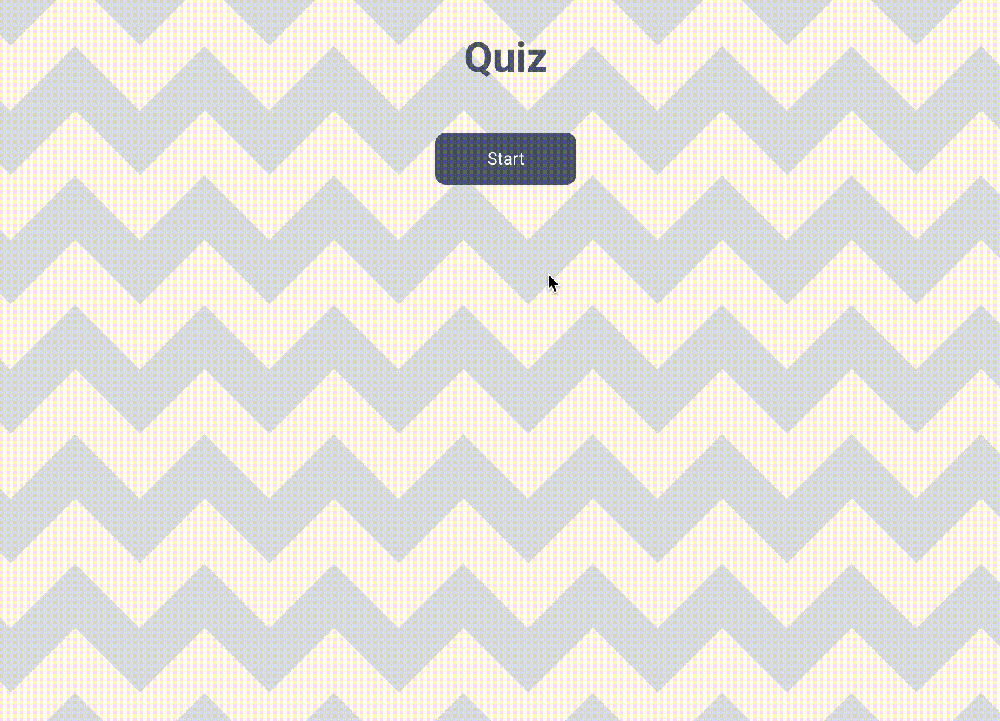

# Title

- [Available Scripts](##-available-scripts)

- [Description](##-description)

- [Licence & Copyright](##-licence-&-copyright)

—-

## Available Scripts

In this project directory, you can run:

`npm install`

Installs all the required dependencies to run the project.

`npm start`

Runs the app in the development mode. Open [http://localhost:3000](http://localhost:3000/) to view it in the browser.

The page will reload if you make edits. You will also see any lint errors in the console.

`npm test`

Launches the test runner in the interactive watch mode. See the section about [running tests](https://facebook.github.io/create-react-app/docs/running-tests) for more information.

`npm run build`

Builds the app for production to the `build` folder. It correctly bundles React in production mode and optimizes the build for the best performance.

The build is minified and the filenames include the hashes. Your app is ready to be deployed!

—-

## Description

A simple quiz game developed using React and TypeScript where ten random questions with their possible answers are fetched from an API every time the user clicks on the Start button.

## Licence & Copyright

Development: [Junyi Ji](mailto: junyiji@gmail.com)

2020
